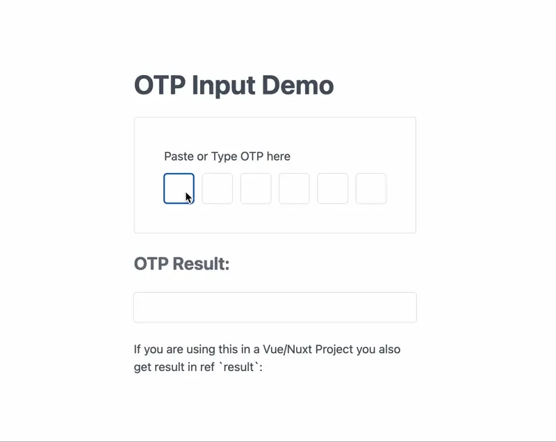

## Unstyled OTP Input

A JavaScript library that provides a user-friendly way to input OTP (One-Time Password) codes. It can be used in various JavaScript frameworks or environments to enhance the OTP input experience.




### Installation

You can install via npm:

```bash
npm install @rashidpathiiyil/otp-input
```

### Usage

#### Importing and Setup

To use `@rashidpathiiyil/otp-input` in your JavaScript application, import it and initialize it with the appropriate parameters. Below is an example setup:

```javascript
import OTP from '@rashidpathiyil/otp-input';

const initOTPInput = new OTP(
  '.otp-input-container',
  '.otp-result-input'
);
```

#### HTML Structure

Define the HTML structure for the OTP input component. Below is an example:

```html
<div class="otp-input-container">
  <!-- Input fields for OTP -->
  <input type="text" />
  <!-- Add more input fields as required -->
</div>

<!-- Display OTP result -->
<input class="otp-result-input" type="text" />
```

### Example

Below is an example of how you can use it in your Vue/Nuxt application:

```html
<script setup>
import { onMounted, ref } from 'vue';
import OTP from '@rashidpathiyil/otp-input';
const result = ref(); 

onMounted(() => {
  const initOTPInput = new OTP(
    '.otp-input-container',
    '.otp-result-input',
    result
  );
});
</script>
<template>
  <div class="otp-input-container">
    <!-- Input fields for OTP -->
    <input type="text" />
    <!-- Add more input fields as required -->
  </div>

  <!-- Display OTP result -->
  <input class="otp-result-input" type="text" />
  <!-- Display OTP using ref -->
  {{ result }}
</template>
```

You can try out a Vue.js demo on StackBlitz:

[Vue.js Demo - @rashidpathiiyil/otp-input](https://stackblitz.com/edit/rashidpathiyil-otp-input)

### Support and Contributions

For support or to contribute to the development of `@rashidpathiiyil/otp-input`, please visit the GitHub repository: [https://github.com/rashidpathiiyil/otp-input](https://github.com/rashidpathiiyil/otp-input)
